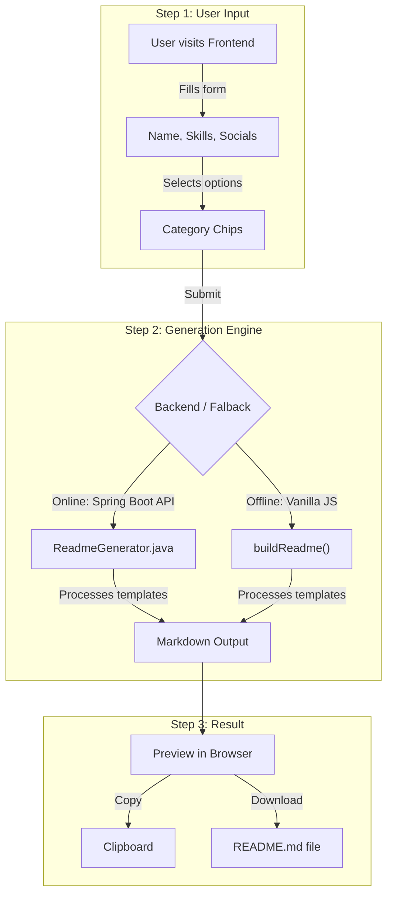

# 🛠️ README Profile Builder


A dynamic web application that generates stunning, professional **GitHub Profile READMEs** with a few clicks. Features a modern brutalist design, dynamic categorization, and an offline JavaScript fallback builder.

---

## 🔄 How It Works



---

## 🚀 Quick Start

```bash
git clone https://github.com/Deekshith06/README-Profile-Builder.git
cd README-Profile-Builder

# Start the Backend (Java 17+ & Maven required)
cd backend
mvn spring-boot:run
# Server runs on http://localhost:8080

# Open the Frontend
cd ../frontend
open index.html # Or just double click the file
```

> ⚡ **Offline Mode**: The tool works completely offline without the backend running, utilizing a powerful JavaScript fallback generator!

---

## 📂 Project Structure

```text
├── backend/                       # Spring Boot Java Backend
│   ├── src/main/java/.../         # Core API and Generator code
│   │   ├── MainApplication.java   # Spring Boot entry point
│   │   ├── ReadmeGenerator.java   # Builds the README markdown
│   │   └── Controller.java        # REST API endpoints
│   └── pom.xml                    # Maven dependencies
└── frontend/                      # Vanilla JS/CSS Frontend
    ├── index.html                 # Main interface
    ├── style.css                  # Modern UI styling
    └── script.js                  # Form logic & Offline Builder
```

---

## 🔧 Tech Stack

| Component | Technology |
|-----------|------------|
| Frontend | HTML5, Vanilla CSS, Vanilla JS |
| Backend API | Java 17, Spring Boot 3.2 |
| Build Tool | Maven |

---

## ✨ Features

| Feature | Description |
|--------|-------------|
| **Dynamic Headers** | Capsule-render animated waving banners |
| **Typing Animation** | Cycles through your top skills |
| **Categorization** | Auto-categorizes skills into languages, AI, DBs, etc. |
| **Rich Badges** | Shields.io and TechStack SVGs |
| **GitHub Stats** | Streak, Summaries, Trophies, and Contribution heatmaps |

---

## 👤 Author

**Seelaboyina Deekshith**

[](https://github.com/Deekshith06)
[](https://www.linkedin.com/in/deekshith030206)
[](mailto:seelaboyinadeekshith@gmail.com)

---

> ⭐ Star this repo if it helped you!
